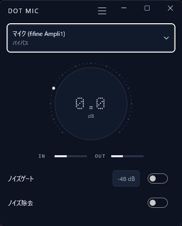

# DOT MIC

Windows 11向けのマイク音量調整アプリです。Discordなどで使用している入力設定をを変更せず、ゲイン調整やノイズキャンセリングを適用できます。

**[ダウンロード](https://github.com/iwafuu0106-jpg/dot-mic/releases/download/v0.4.2/DOT.MIC.0.4.2.zip)**

Windows 11 x64 / Community Release




## 導入方法


### 1. ZIPをダウンロードして展開

まずは`DOT MIC 0.4.2.zip`をダウンロードし、ZIP全体を展開してください。

展開後、セットアップ.exeを開いてください。

```text
セットアップ.exe  ← 最初に開く
DOT MIC.exe       ← 導入後に開く
内部ファイル/      ← 移動・削除しない
```


### 2. セットアップ.exeを開く

セットアップ画面で使用するマイクを選択し、変更内容を確認して「同意して導入」を押します。再起動が必要と表示された場合だけWindowsを再起動してください。


### 3. DOT MICを起動

`DOT MIC.exe`を起動します。

初期設定は、音量補正 0 dB・ノイズゲート無効・ノイズ除去無効です。ノイズ除去やノイズゲートは必要に応じて有効にしてください。

Discordでは従来の物理マイクを選択してください。「DOT MIC」という新しい録音デバイスは作成されません。


### SmartScreen

Community版はAuthenticode／Microsoft認証版ではないため、Windows SmartScreenが確認画面を表示する場合があります。公式配布元はこのGitHub repositoryと[Releases](https://github.com/iwafuu0106-jpg/dot-mic/releases/tag/v0.4.2)です。


## 使い方

ダイヤルで入力音量を調整し、ノイズゲート・ノイズ除去を必要に応じて有効にします。効果を一時停止する場合はメニューでバイパスを有効にします。Discord側に新しい入力を選ぶ必要はありません。


## 主な機能

- Gain：マイク入力を増幅・減衰します。
- Noise Gate：設定したレベルより小さい入力を抑えます。
- Noise Cancellation：DPDFNet2をローカルCPUで実行してノイズを抑制します。音声はクラウドへ送信しません。
- Limiter：過大な出力レベルを抑えます。


## 問題がある場合

- DOT MICが効かない：`セットアップ.exe`で「修復」を選択します。
- アンインストール：セットアップで「削除」を選択します。
- 「復旧が必要です」と表示：セットアップで「復旧」を選択します。保存した復旧データは削除しないでください。


## 開発者向け・技術情報

- [source ZIP（開発者向け）](https://github.com/iwafuu0106-jpg/dot-mic/releases/download/v0.4.2/DOT.MIC.0.4.2-source.zip) — 通常利用には不要です。
- [ソースのbuild方法](Community/SOURCE.md)
- [第三者ライセンス・notice](licenses/README.md)
- [受入結果の概要](Community/PUBLIC-ACCEPTANCE.md)
- [Release構成・version・旧版復旧の補足](docs/release-0.4.0-community.md)
- [SHA-256](https://github.com/iwafuu0106-jpg/dot-mic/releases/tag/v0.4.2)
